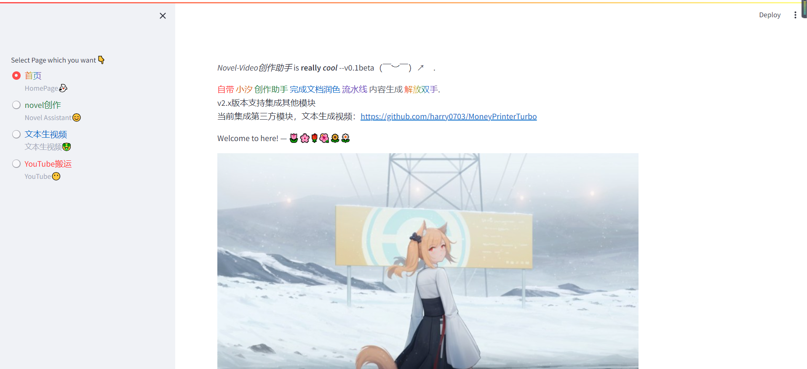
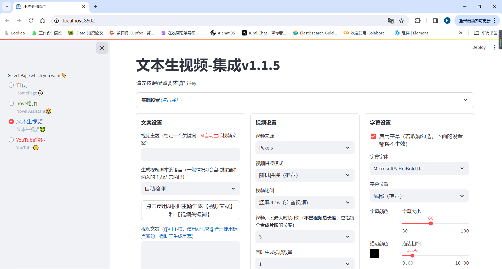
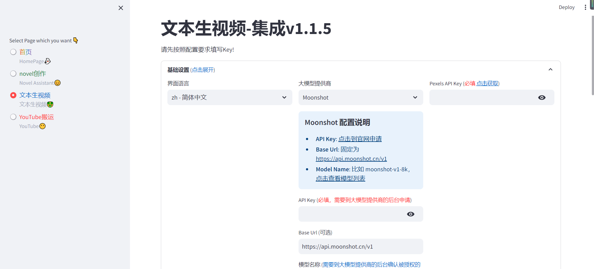

# 项目简介

 小汐创作助手迎来2.0版本，我们将创作助手的功能不仅仅局限与小说推文创作，而是将其功能扩展到更多领域。
 未来，我们将基于小汐创作助手2.0版本，开发出更多有趣的功能，帮助用户更高效地创作内容。
 未来开发方向如下：

    1.  针对 API 开放，当前创作助手对接API为公有API，生成效果并不理想，同时助手只是提供了一个平台对于更加复杂的操作
        例如生成带有动态效果的视频而不是单一的图片，保存人物角色一致性等等问题，都需要我们通过本地模型优化，而后针对
        小汐创作助手开放API接口，从而让小汐创作助手更加强大。

    2.  针对平台本身进行优化，我们将对平台的功能进行更多元化的功能。

    3.  将webUI与功能代码分离，提供可复用平台API接口，将Service与UI分离，便于后续前端重构

    4.  结构化工程代码，将不同模块以不同Application的形式进行开发，并抽取插件功能，为后续平台扩充提供可能性

(PS:)1.0使用请继续参考文档：README-V1.0.MD
当前项目已重构，原先小说助手在app模块下，具体配置与原先保持一致，但也直接使用发布的1.0版本~😁
 
# V2.0 feature😍

（——）注意当前V2.0版本处于开发阶段，您可以使用V1.0发行版本，原先功能依然可正常使用，但考虑到稳定性，建议您使用v1.0版本。当功能更新完毕，此说明文字将消失😀

 1. 更新操作界面，为后续增加新功能做好准备

    
 
 2. 整合文本生视频功能

    
    
    使用时仅需按照基础配置配置Key即可，使用免费素材网站搜索获取素材
    
    

 4. YouTube视频搬运功能（该过程涉及到网络问题，因此项目提供key需付费获取）

# 联系方式🧵
如果您对本项目感兴趣，同时也想要参与到项目当中，与其他志同道合的小伙伴一起交流，您可以扫描下方二维码，加入我们的群聊，欢迎您的加入😁

QQ群：538545770