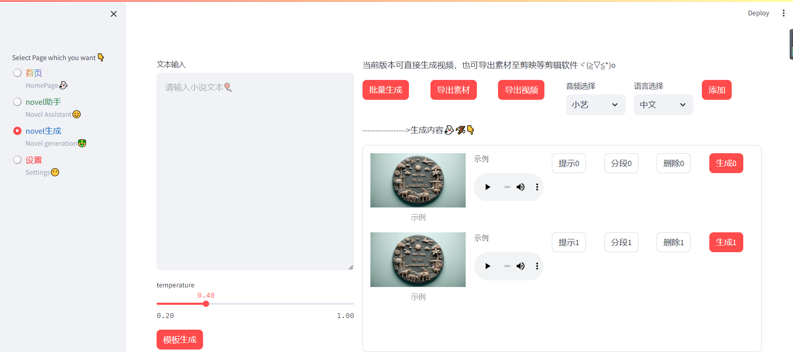
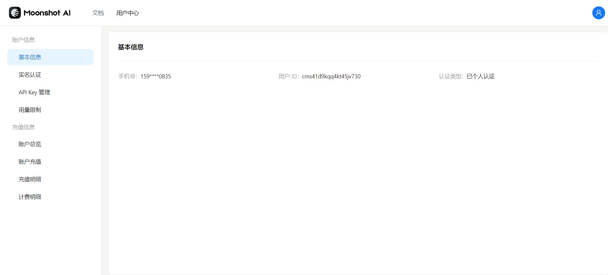
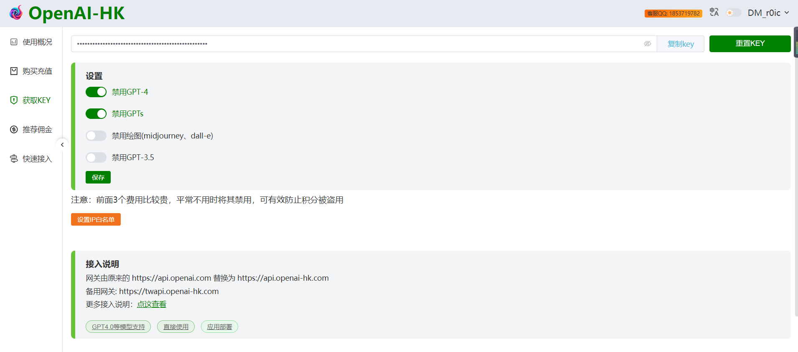
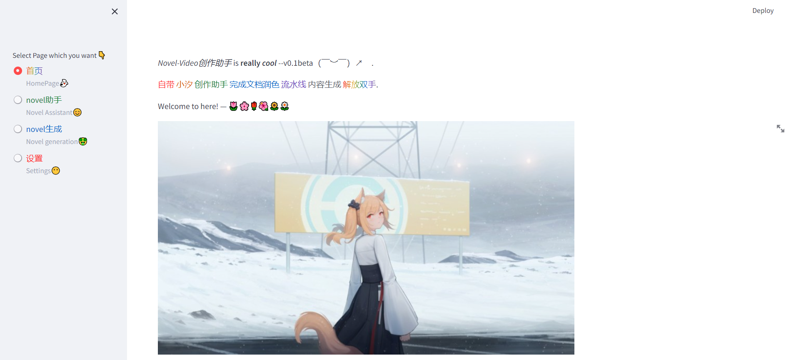
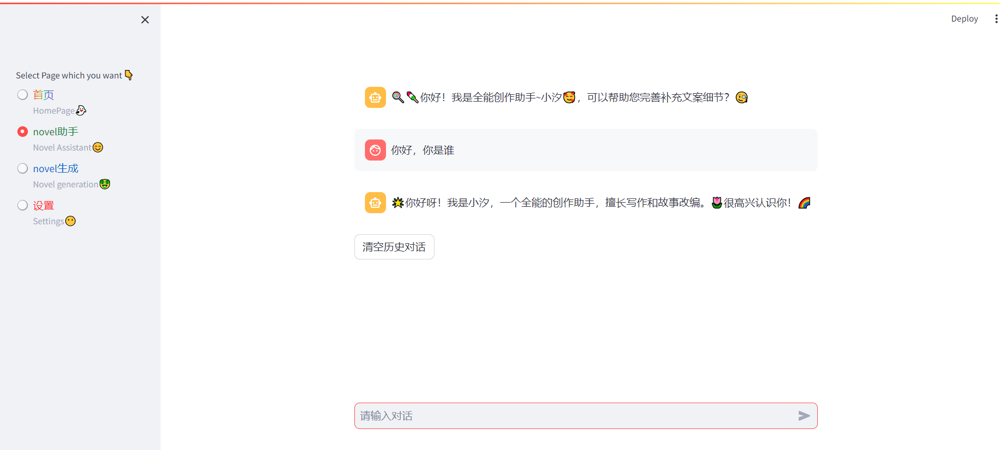
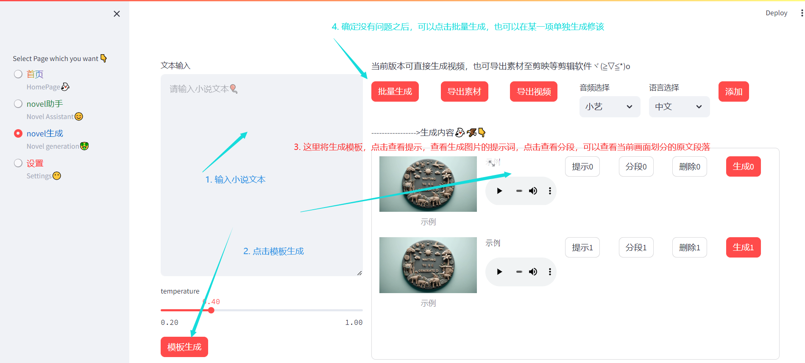
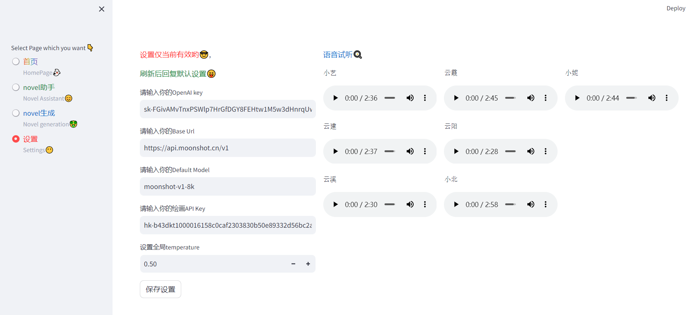

# 项目简介

By Huterox is making a tool for novel.

不知道你是否经常在蹲坑之时见闻过”柳如烟“大帝之名。是否好奇过这样的视频是如何生成的？那么今天，我们就将揭开这并不神秘的面纱。那么同样的废话不多说，我们来大致看到我们最终将要实现的效果：


当然秉承着我们一贯的风格，当你看见这篇博文的时候，我们已经将其开源了。我们将对当前版本的源代码进行开放。同时你对于如何从开始构建这一软件感到好奇，那么需要订阅本专栏进行查阅。是的，这需要花费一杯奶茶的价格。不过授人以鱼不如授人以渔，我建议可以尝试一下😀

**当然本章作为开放章节，我们将重点介绍此软件是如何工作的，尤其是如果你想要将其运用在你的自媒体创作当中，当然原理技术篇需要订阅专栏。**
>[专栏地址](https://blog.csdn.net/futerox/category_12649068.html)

在原理篇你将见到：
1. 如何使用streamlit构建一个UI🍕
2. 如何异步请求api，与LLM交互🌯
3. 如何对接语音🍤
4. 如何使用Prompt工程打造一个Agent完成工作🍟
5. 如何将素材打包为视频🥐
6. 怎么导出媒体压缩包文件，便于后续剪辑🍚
7. 将所有的功能整合起来，并制作docker镜像🚎
8. 如何将服务通过docker与Linux管理面板完成服务部署❤

# 快速开始
后续你可以直接使用docker进行部署，但是抱歉，当前我还没有制作对应的docker镜像以供使用。因此需要克隆本项目，之后按照我们的快速开始，来完成您的环境搭建。
## 1. 安装依赖
整个项目，直接采用调用API的形式完成服务，当然，关于API如何调用，需要作何准备，我们待会在环境
准备章节将详细描述👀。
本项目采用的Python版本为3.10，为了避免兼容性问题，我们推荐使用Python3.10进行开发。

```python
pip install -r requirements.txt
```

## 2. api_key准备🚎

由于我们的整个项目采用的是调用API的形式完成服务，因此我们需要提前准备好API_KEY。当然，您也可以直接使用LLama在本地部署大模型，同时通过one_api这个项目完成本地LLM接口的搭建。同时，在本地通过sd webui完成Sd的绘图服务创建，这样依赖，您将不需要使用付费api即可完成服务。当然，考虑到本土化项目，我们使用的api不需要特殊网络也可以正常访问，这一点非常重要，这意味着，您将在中国大陆完整的体验到整个项目🍡
首先我们使用了哪些api服务？🧐
1. MoonShot 暗夜之面
2. hk-openai 中转站api平台
	对接：
		1. openAI 
		2. Mj 绘图

因此，为了让您的项目能够正常运行，您需要申请到这些api_key。当然值得一提的是，我们对于语音生成采用的api是egg_tts完成生成，它调用了Azure。因此您不需要额外申请使用Azure的语音服务，也不需要虚拟信用卡来完成Azure账户的激活。

### MoonShot 
现在我们来获取暗月之面的API，这里我们需要进入到开发平台：[https://platform.moonshot.cn/console/info](https://platform.moonshot.cn/console/info) 这里你可能比较好奇，为什么使用这个LLM，实际上，是因为综合体验下来，它的中文效果较好，可以完成较为复杂的操作，相对于3.5或者其他模型来说。同时价格在能够接受的合理范围，当然，在我们接下来使用的中转站当中也可以直接使用GPT4.0但是使用成本将大大提升！

进入平台之后，按照平台提示即可完成创建，当然这里注意，免费用户有15元钱的token，但是存在并发限制，因此建议适开通付费提高并发量。

### 中转站
之后，我们需要获取到中转站的key,这一点同样重要。我们主要使用其做了两件事情：

	1. 对接Mj图片生成服务🐱‍🏍
	2. 对接chatgpt3.5主要充当翻译任务
我们使用MoonShot主要充当对话服务，以及对文本的归纳整理✔ 。

同样先点击链接：[https://openai-hk.com/](https://openai-hk.com/?i=16158) 完成注册，之后按照[平台文档](https://www.openai-hk.com/docs/getting-started.html)完成api获取。这里需要注意一点。并且网站比较良心的是，当前openai免费开放了3.5，在中转站也同样免费开放。不过我们需要使用到Mj服务，因此我们依然需要开通key。
注意，获取之后请开放您key的Mj权限：



### 准备就绪
当您完成了您的本地项目环境以及获取了对应的api_key之后。您需要在您的项目根目录，创建一个`config.json` 文件，并且粘贴如下内容：
```json

{
    "openai_api_key": "moonshot-key",
    "openai_api_base": "https://api.moonshot.cn/v1",
    "language": "auto",
    "hide_history_when_not_logged_in": true,
    "default_model": "moonshot-v1-8k",
    "temperature": 0.5,
    "multi_api_key": false,
    "server_name": "0.0.0.0",
    "server_port": 9090,
    "autobrowser": false,
    "share": false,
    "system_xiaoxi": "你是一个全能小助手，你的名字叫小汐，尤其擅长写作和故事改编。",
    "image_api_key": "中转站-key"
}
```


# 功能⚽
我们功能主要如下：
1. 首页展示
2. 对话助手
3. 视频生成助手
4. 设置

我们的整个项目的UI采用Streamlit进行编写，当然一开始我们采用的是Gradio但是很遗憾，在某些场景之下Gradio无法满足我们的需求，因此只能忍痛重构。当然值得一提的是，作为开源版本，我们的很多功能还有待完善。后续我们有计划进行升级，敬请期待🎈


## 首页
这一步确实没有什么，只是对我们项目的基本情况的介绍：

## 创作助手
这里我们的创作助手，主要对接的还是我们的MoonShot。当然我们修改了prompt，它是我们的助手”小汐“🎪


## 视频生成🖼
接下来就是我们的重头戏了，如何使用视频生成器🎞
一张图快速了解：


## 设置🐱‍👤
这里注意，在设置页面设置的内容，仅本次打开网站有效，刷新网页之后，将恢复您在config.json当中填写的内容，这里只是做临时设置使用哦🧐



# 联系方式🧵
如果您对本项目感兴趣，同时也想要参与到项目当中，与其他志同道合的小伙伴一起交流，您可以扫描下方二维码，加入我们的群聊，欢迎您的加入😁

QQ群：538545770